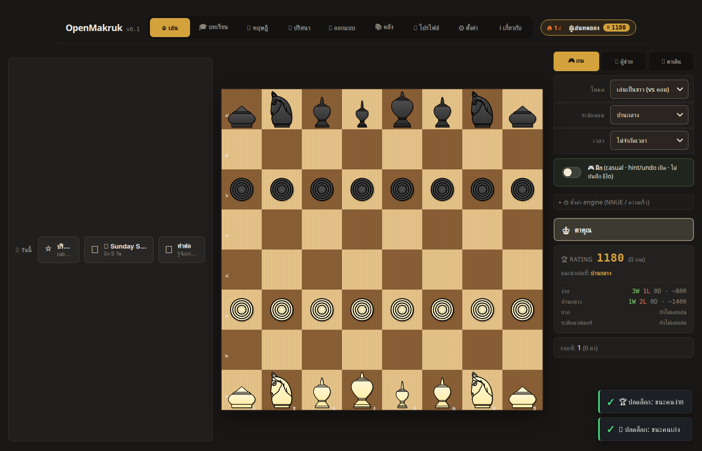
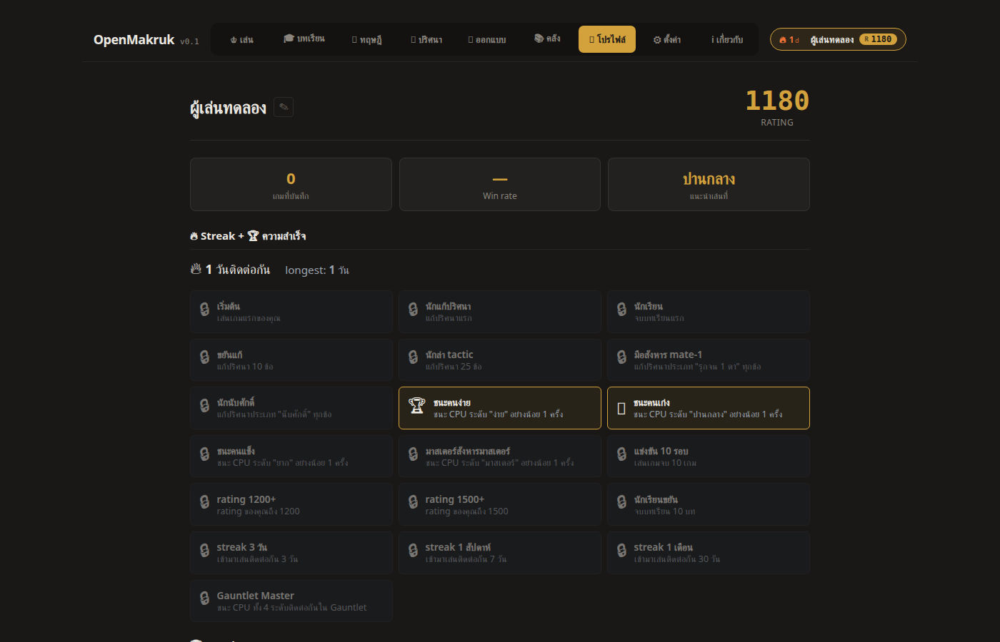
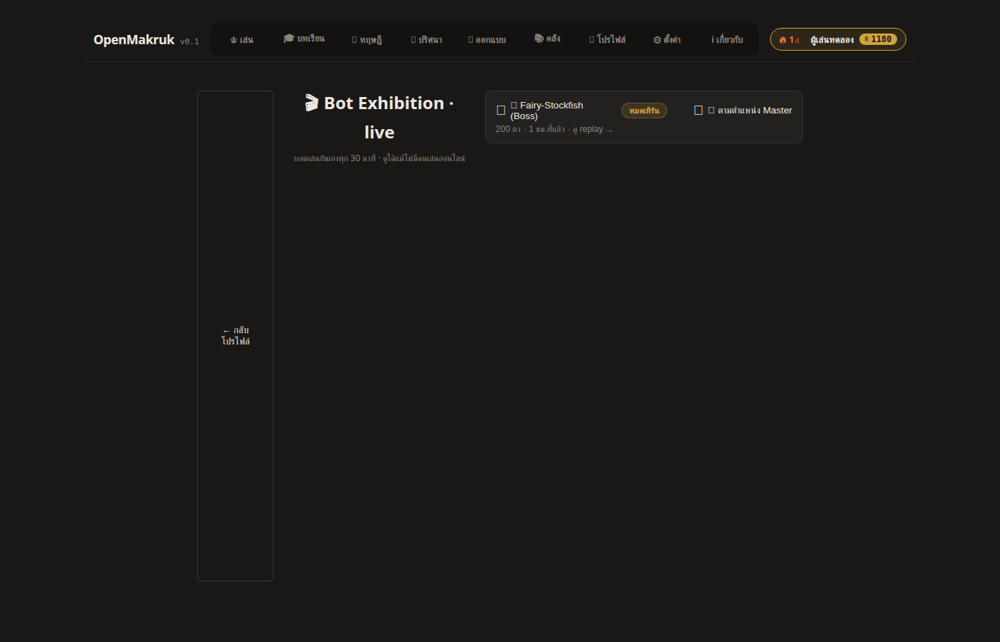

<div align="center">

# OpenMakruk

**Train · Play · Analyze Thai Chess (Makruk)**

A modern, Thai-first training platform for หมากรุกไทย — the ancestor of modern chess, still played by millions in Thailand but underserved by the digital chess world.

[**▶ Live at openmakruk.com**](https://openmakruk.com)  ·  [API](https://openmakruk-api.cnatthaphon.workers.dev/api/health)  ·  [Report an issue](https://github.com/cnatthaphon/openmakruk/issues)

[](LICENSE)
[](tests/e2e)
[](worker/tests)
[](https://openmakruk.com)
[](https://openmakruk.com)
[](#architecture)



</div>

---

## Why this exists

`pychess.org` supports Makruk but as one of 30+ variants — its UI is English-first and built for the variant generalist. Existing Thai-language Makruk sites are multiplayer-only and have no training tools. **Nowhere combines hint + post-game analysis + puzzles + lessons + opening/endgame study + personality bots + native Thai UI under one roof.** That's the gap OpenMakruk fills.

The platform is **offline-first**: every feature works in the browser with no account, no server, no ads. Cloud sync is opt-in and only used for global leaderboards and cross-device history.

---

## Features

### Play
- **Engines** — Fairy-Stockfish (NNUE-ready, full strength) plus 7 personality bots (⚔️ นักบุก · 🛡️ นักรับ · 🧭 ตามตำแหน่ง · 🦅 นักล่า · 🍃 นักเดิน · 💨 คล่องตัว · 🐢 ระวังตัว). Each personality runs minimax + α-β at tier-appropriate depth and consults a built-in opening book so successive games feel distinct.
- **Bot challenge mode** — click ⚔️ "ท้าดวล" on any of the 22 bot character profiles to lock the Play tab to that opponent. Wins and losses count toward that specific bot's head-to-head record in the Hall of Fame.
- **Game UX** — hint button · post-move chess coach explanation · live eval bar · auto-analyze toggle · draw offers with engine-evaluated response · resume in-progress game across reloads · PGN export.
- **Time controls** — Unlimited · Blitz 5 · Blitz 5+3 · Rapid 10 · Rapid 15+10 · Classical 30.
- **Post-game review** — full move-by-move classification (best / good / inaccuracy / mistake / blunder) with Thai narrative commentary, "key moments" surface, and a "what if?" variation explorer.

### Learn
- **29 lessons** — step-by-step piece movement → tactics → endgame patterns, with interactive boards at every step.
- **5 verified openings** — ขุนเบี้ย, เม็ดเดิน, โคน fianchetto, โคน line, เรือ line — each with commentary and ratings band.
- **5 annotated endgames** — K+R vs K corner, K+RR vs K ladder, K+R+M vs K, etc.
- **4 tactical themes** — hanging piece, fork, skewer, pawn capture.

### Train
- **74 puzzles** across 5 categories — mate-in-1 (14), mate-in-2 (5), tactic (17), counting (13), defense (5).
- **Daily puzzle** — deterministic by date, same puzzle for everyone worldwide.
- **🔢 Counting Trainer drill mode** — 5 progressive levels (K+RR vs K → K+R+M vs K+S) testing the Makruk-specific honor count rule. Live countdown, 3-star scoring based on efficiency vs the count limit. Makruk-unique — nothing else online offers this.
- **🔥 Puzzle Rush** — 3-minute timed mode, 3 strikes ends the run, personal-best leaderboard.
- **Personal puzzle rating** (Glicko-lite) + spaced repetition (SM-2 algorithm).
- **3 content pipelines** — user authoring (Custom tab) · puzzle miner from your own blundered games · auto bot-vs-bot mining factory. All engine-verified server-side.

### Compete
- **22 bot characters** — 7 personalities × 3 tiers (Rookie / Veteran / Master) plus Fairy-Stockfish Boss. Each has lore, motto, strengths, weaknesses, and a live rating that updates with every human game.
- **🎬 Bot Exhibition** — Cloudflare Worker cron picks two bots every 30 minutes and plays them against each other; the platform stays alive with fresh content even when no users are online. Public feed + step-through replay viewer.
- **Province + region leaderboards** — 77 จังหวัด, 6 ภาค. "กทม. vs เชียงใหม่" head-to-head.
- **🏆 Sunday Showdown** — ×1.5 rating multiplier tournament every Sunday 14:00–18:00 Bangkok time.
- **Badges + shareable cert pages** — server-side tier ladder (bronze → silver → gold → diamond). Each unlocked badge gets a public URL anyone can open.
- **Journey path** — 6-level progression (beginner → master), each level a published checkpoint set.
- **Gauntlet mode** — beat all 4 difficulty levels back-to-back.
- **Activity ticker** + "วันนี้" feed strip — real engagement signals on the home screen.

### Custom + Library
- Graphical position editor with drag-and-drop pieces. Play out from any FEN, save to a personal library, or convert into a puzzle.
- Position library: custom, play-derived, puzzle-imported, and analysis-source filters. Search + load.

### Profile + Settings
- Match Score, Gauntlet, Tournaments, Bot Hall of Fame, badges, journey, achievements, streak, recent games.
- **Insights** — color split, level split, game-length distribution, recent form trend, day-of-week activity.
- **Global Match Leaderboard** (opt-in via cloud sync).
- **Engine selector** — every registered engine (Fairy-Stockfish, baselines, all 7 personalities) shows up in the dropdown automatically.
- Piece sets · board themes · animation speed · sound toggle · eval bar · move highlights · legal-move dots.

---

## Screenshots

<table>
<tr>
<td width="33%">
  
  <p align="center"><sub>♔ Play — board + engine + sidebar</sub></p>
</td>
<td width="33%">
  
  <p align="center"><sub>👤 Profile — rating, badges, achievements</sub></p>
</td>
<td width="33%">
  
  <p align="center"><sub>🎬 Bot Exhibition — cron-generated bot games</sub></p>
</td>
</tr>
</table>

---

## Architecture

Two-tier design: **client-first** with an **optional** Cloudflare backend for global features.

```
┌─────────────────────────────────────────────────────────────────┐
│  Browser (React 18 + Vite + TypeScript, ~390 KB gzip)          │
│                                                                 │
│  • UI: 9 visible tabs + 5 hidden deep-linkable routes           │
│    (/cert, /bots, /counting, /rush, /exhibition)                │
│  • Engine registry (MakrukEngine contract)                      │
│    - Fairy-Stockfish (WASM, NNUE-capable)                       │
│    - Random / Greedy baselines                                  │
│    - 7 personality bots (minimax + α-β, tier-aware depth,       │
│      opening book, personality-weighted scoring)                │
│  • Backend adapter (BackendAdapter contract)                    │
│    - NoOpBackend by default → fully offline                     │
│    - CloudflareBackend when user opts in to sync                │
│  • Versioned localStorage via defineStore wrapper               │
│  • PWA: manifest + service worker · installable on mobile       │
│  • Sound effects: Web Audio synthesis (no audio assets)         │
└────────────────────────────┬───────────────────────────────────┘
                             │  HTTPS · bearer token
                             ▼
┌─────────────────────────────────────────────────────────────────┐
│  Cloudflare Worker — openmakruk-api.workers.dev (optional)      │
│                                                                 │
│  Hono routing · D1 (SQLite at edge) · 12 endpoint groups        │
│   /api/users · /api/games · /api/puzzles · /api/leaderboard     │
│   /api/bots · /api/badges · /api/cert · /api/journey            │
│   /api/tournaments · /api/signals · /api/exhibition             │
│                                                                 │
│  • Anonymous bearer auth (SHA-256 hashed in D1)                 │
│  • Server-side Elo math (K=32, cheat-proof)                     │
│  • Pure-JS Makruk rules engine — replays every submitted game,  │
│    rejects illegal sequences before insert                      │
│  • Bot Exhibition cron (*/30 * * * *) — picks two bots and      │
│    plays them out with the same minimax engine, stores result   │
│  • D1 migrations system (6 applied, additive only)              │
└────────────────────────────────────────────────────────────────┘
```

**Key property:** everything client-side works without the backend. Cloud sync is opt-in and exists only for cross-device sync and global leaderboards. A single user playing offline never needs an account.

---

## Quick start (development)

```bash
# Frontend
npm install
npm run dev                       # http://localhost:5174

# Worker (optional — only for cloud-sync development)
cd worker
npm install
npm run db:reset:local            # apply 6 migrations to local D1
npm run dev                       # http://localhost:8788

# In the browser, open Settings → Cloud Sync → "เปิด cloud sync"
# to connect to the local worker.
```

---

## Testing

```bash
npm run test:e2e                  # Playwright — 81 tests / 16 spec files
cd worker && npm run test         # Vitest — 52 worker integration tests
```

The Playwright config auto-starts a `wrangler dev` worker on port 8788 so cloud-sync e2e tests get a real backend to talk to.

**Test pyramid:**
- **Frontend e2e (Playwright)** — smoke, foundation, play, lessons, puzzles, personalities, mobile/touch, onboarding, resume bug, schema versioning, PWA install-readiness, cloud sync, hidden-route smokes (counting / rush / exhibition).
- **Worker integration (Vitest)** — wrangler dev + local D1 + scenario tests covering registration, auth, game-record verification, rating progression, leaderboard ordering, puzzle catalog, badge tier ladder, journey checkpoints, input validation.

---

## Deployment

### Worker

```bash
cd worker
npx wrangler d1 create openmakruk-db                   # one-time, paste the id into wrangler.toml
npx wrangler d1 migrations apply openmakruk-db --remote
npx wrangler deploy                                    # production URL printed
```

Cron triggers and D1 binding live in `worker/wrangler.toml`.

### Frontend

```bash
VITE_API_BASE=https://openmakruk-api.<account>.workers.dev npm run build
npx wrangler pages deploy dist --project-name openmakruk --branch main
```

Or hand `dist/` to any static host. `_headers` and `_redirects` are bundled so Cloudflare Pages serves the correct CSP and SPA-fallback routing.

CI auto-deploys both layers on push to `main` via GitHub Actions (`.github/workflows/ci.yml` for Pages, `.github/workflows/deploy-worker.yml` for the worker). Both need `CLOUDFLARE_API_TOKEN` and `CLOUDFLARE_ACCOUNT_ID` repository secrets.

---

## Anti-cheat

Match-leaderboard rows require `verified=1`. The full verification flow per submitted game:

1. Client `POST /api/games` with `mode: 'rated'` and the full UCI move log.
2. Worker replays every move through `worker/src/rules.ts` — a pure-JS Makruk rules engine that doesn't share code with the client.
3. Any illegal move → 422 — the row is never inserted.
4. Final position must classify as the claimed outcome (mate / stalemate / counting draw).
5. On pass: row inserted with `verified=1`; user's server-side rating updated via Elo (K=32).

Editing browser localStorage gives you nothing — the server is the source of truth for everything that affects the global leaderboard, including bot head-to-head records and badge eligibility.

---

## Stack

| Layer | Tech |
|---|---|
| Frontend | Vite + React 18 + TypeScript (strict mode) |
| Board | chessground v9.x (Lichess board library) |
| Engine (client) | ffish-es6 + fairy-stockfish-nnue.wasm |
| Engine plugins | MakrukEngine contract · ScoredBot minimax personality bots |
| State | localStorage + IndexedDB via versioned defineStore |
| Routing | Hash-based custom router (deep-linkable) |
| Sound | Web Audio API (no asset files) |
| Worker | Cloudflare Workers + Hono |
| Database | Cloudflare D1 (SQLite at the edge) |
| Worker engine | Pure-JS Makruk rules + minimax exhibition simulator |
| Cron | Cloudflare scheduled trigger (`*/30 * * * *`) |
| Tests | Playwright (e2e) + Vitest (worker integration) |
| CI/CD | GitHub Actions → Cloudflare Pages + Workers |

---

## Contributing

Issues and PRs welcome. Conventions:

- **Reproducible installs** — `npm ci` at root and in `worker/`. `.npmrc` pins `legacy-peer-deps=true` because `eslint-plugin-react` still has React 18 peer ranges.
- **Quality gates** — every PR runs typecheck + lint + build + worker integration tests + Playwright e2e in CI before merge.
- **Adding a new engine** — drop a file in `src/lib/engines/`, implement the `MakrukEngine` interface, register at module load. The Settings dropdown picks it up automatically.
- **Adding a new personality bot** — append one entry to `src/lib/personalities/personalities.ts`. No new class. The catalog drives both the engine registry and the Bot Hall of Fame seed.
- **Adding puzzles** — edit `public/content/puzzles/all.json`, bump the manifest version, and run `worker/scripts/seed-curated.mjs` to refresh the server-side seed if cloud sync should serve them.
- **Adding lessons / openings / endgames / themes** — same pattern, separate JSON manifests under `public/content/<kind>/all.json`.
- **Schema changes** — add a numbered SQL file to `worker/migrations/`. The system is additive — no destructive operations on production data.

---

## License + Credits

Code under **MIT**. Piece SVGs under **CC BY-SA 4.0** (Yevrowl, Fulmene, belzedar_, via Wikimedia Commons — see `public/pieces/NOTICE`). Fairy-Stockfish is **GPL-3.0**; chessground is **GPL-3.0**. Full attribution on the About tab.
